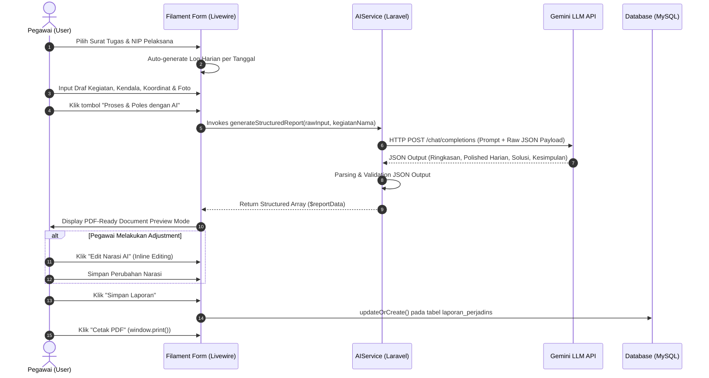

# DOKUMEN SPESIFIKASI KEBUTUHAN SISTEM & DESAIN TEKNIS
## Modul Laporan Perjalanan Dinas (LPD) Terintegrasi Generative AI (LLM)
**Sistem Informasi Perjalanan Dinas & Akuntabilitas (SIPEDAS)**  
*Badan Pusat Statistik (BPS)*

---

### 1. RINGKASAN EKSEKUTIF & LATAR BELAKANG
Dokumen ini disusun sebagai spesifikasi kebutuhan teknis dan bukti dukung pengembangan **Modul Laporan Perjalanan Dinas (LPD) Berbasis Generative AI** pada sistem SIPEDAS. 

Inovasi ini dirancang untuk mengatasi hambatan administratif pegawai dalam menyusun laporan perjalanan dinas yang formal, terstruktur, dan akuntabel. Pegawai cukup menginputkan *catatan harian mentah/draf bebas*, koordinat lokasi (GPS), dan foto lapangan. Selanjutnya, **Generative AI (API LLM)** secara otomatis mentransformasikan draf mentah tersebut menjadi narasi Laporan Perjalanan Dinas resmi berstandar tata bahasa pemerintah (EYD/PUEBI) yang dilengkapi dengan Ringkasan Eksekutif, Rincian Harian (Uraian, Kendala, Solusi), Kesimpulan, dan Rekomendasi/Tindak Lanjut.

---

### 2. IDENTIFIKASI FIELD INPUTAN LAPORAN PERJALANAN DINAS (USER INPUT)

Input data dibagi menjadi 2 (dua) tingkatan: **Header Penugasan (Metadata)** dan **Log Harian PerTanggal (Iterative Daily Logs)**.

#### A. Header Penugasan (Metadata Level)
| Nama Field | Tipe Data | Sifat | Deskripsi / Sumber Data |
|---|---|---|---|
| `selectedSuratTugasId` | Foreign Key (`bigint`) | Wajib | Relasi ke Surat Tugas yang disetujui (`surat_tugas_id`). |
| `selectedPelaksanaNip` | String (18 Digit) | Wajib | NIP Pegawai Pelaksana perjalanan dinas. |
| `tanggalLaporan` | Date (`YYYY-MM-DD`) | Wajib | Tanggal pembuatan/pengajuan laporan (Default: `now()`). |
| `kegiatanNama` | String | Auto-fill (Read-only) | Nama kegiatan dinas dari data master `kegiatans`. |
| `rentangTanggal` | Date Range | Auto-fill (Read-only) | Rentang tanggal `tgl_mulai_tugas` s.d `tgl_akhir_tugas`. |

#### B. Log Harian Kegiatan (Daily Logs Array Level)
Rentang hari secara otomatis direkonstruksi oleh sistem berdasarkan tanggal mulai dan tanggal selesai penugasan. Setiap hari memuat field input berikut:

| Nama Field | Tipe Data | Control UI | Deskripsi / Format |
|---|---|---|---|
| `tanggal` | Date (`YYYY-MM-DD`) | System Label | Tanggal kegiatan harian. |
| `waktu_mulai` | String (`HH:MM`) | Input Time/Text | Jam mulai kegiatan (Default: `08:00`). |
| `waktu_selesai` | String (`HH:MM`) | Input Time/Text | Jam selesai kegiatan (Default: `12:00`). |
| `koordinat` | String | Input Text + Geolocation Button | Titik koordinat GPS (`Latitude, Longitude`), misal: `-0.0264, 109.3425`. Fitur auto-detect lokasi via Geolocation API. |
| `uraian_draft` | Text (Long) | Textarea (Min 5 Karakter) | Catatan mentah/draf bebas kegiatan pegawai (misal: *"pergi ke dinas pertanian ketemu pak eko bahas data panen padi seminggu lalu"*). |
| `kendala` | Text | Textarea (Opsional) | Catatan kendala mentah di lapangan (misal: *"hujan lebat sinyal jelek data telat dikirim"*). |
| `photos` / `foto` | File Array (Images) | File Upload (Multiple) | Upload foto dokumentasi kegiatan (.jpg, .png). |
| `gunakan_timestamp` | Boolean | Checkbox | Toggle untuk menampilkan watermark tanggal & koordinat GPS pada foto. |

---

### 3. SPESIFIKASI TEKNOLOGI GENERATIVE AI (API LLM)

#### A. Architecture & Provider
* **Provider / Service**: Google Gemini API Gateway (OpenAI Compatible Endpoint).
* **Base URL**: `https://ai.dvlpid.my.id/v1/chat/completions` (Konfigurasi `.env`: `AI_BASE_URL=https://ai.dvlpid.my.id/v1`).
* **Model Engine**: `gemini-3-flash` (Konfigurasi `.env`: `AI_MODEL=gemini-3-flash`).
* **Metode Otentikasi**: HTTP Bearer Token (`Authorization: Bearer <API_KEY>`).
* **Format Output Mandatory**: **JSON Object Output Mode** (`"response_format": {"type": "json_object"}`).

#### B. System Prompt Engineering & Context Definition
Sistem menggunakan role-based prompt engineering formal untuk menjamin konsistensi output:

```json
{
  "role": "system",
  "content": "Anda adalah asisten AI profesional untuk penulisan Laporan Perjalanan Dinas resmi instansi pemerintah (BPS). Anda selalu membalas dengan struktur JSON yang valid sesuai petunjuk tanpa penjelasan tambahan."
}
```

#### C. User Prompt Structure & Rule Set
Draf kegiatan mentah dikirimkan sebagai payload JSON terstruktur ke LLM dengan aturan transformasi:
1. Perbaikan ejaan, tata bahasa EYD/PUEBI, serta pengubahan kata tidak formal/singkatan (contoh: *"ketemu"* $\rightarrow$ *"bertemu"*, *"dgn"* $\rightarrow$ *"dengan"*, *"pake"* $\rightarrow$ *"menggunakan"*).
2. Rekonstruksi kendala menjadi kalimat dinas yang objektif dan profesional.
3. Sintesis otomatis terhadap **Solusi/Tindak Lanjut** yang rasional meskipun pegawai tidak menginputkan solusi.
4. Pembentukan **Ringkasan Eksekutif** (1-2 paragraf) dan **Kesimpulan Akhir** perjalanan dinas secara holistik.

---

### 4. ALUR INTEGRASI AI (INTEGRATION WORKFLOW FLOWCHART)



---

### 5. SKEMA BASIS DATA (DATABASE SCHEMA & DATA MODELS)

Untuk menampung inputan mentah pegawai sekaligus output hasil generasi Generative AI, dirancang skema basis data terkonfigurasi dengan tipe data `JSON` pada MySQL/MariaDB:

#### Tabel `laporan_perjadins`
```sql
CREATE TABLE `laporan_perjadins` (
  `id` bigint(20) UNSIGNED NOT NULL AUTO_INCREMENT,
  `penugasan_id` bigint(20) UNSIGNED NOT NULL,
  `tanggal_laporan` date NOT NULL,
  `isi_kegiatan` json NOT NULL COMMENT 'Menampung raw input log harian pegawai (draf, koordinat, foto, waktu)',
  `hasil_kegiatan` json NOT NULL COMMENT 'Menampung output terstruktur hasil olahan Generative AI (LLM)',
  `foto_dokumentasi` json DEFAULT NULL COMMENT 'Daftar path file foto dokumentasi lapangan',
  `created_at` timestamp NULL DEFAULT CURRENT_TIMESTAMP,
  `updated_at` timestamp NULL DEFAULT CURRENT_TIMESTAMP ON UPDATE CURRENT_TIMESTAMP,
  PRIMARY KEY (`id`),
  UNIQUE KEY `laporan_perjadins_penugasan_id_unique` (`penugasan_id`),
  CONSTRAINT `laporan_perjadins_penugasan_id_foreign` 
    FOREIGN KEY (`penugasan_id`) REFERENCES `penugasans` (`id`) ON DELETE CASCADE
) ENGINE=InnoDB DEFAULT CHARSET=utf8mb4 COLLATE=utf8mb4_unicode_ci;
```

#### Struktur Payload `isi_kegiatan` (Raw Input JSON)
```json
[
  {
    "tanggal": "2026-08-10",
    "waktu_mulai": "08:00",
    "waktu_selesai": "12:00",
    "koordinat": "-0.026412, 109.342511",
    "uraian_draft": "pergi ke dinas pertanian ketemu pak eko bahas data panen padi seminggu lalu",
    "kendala": "hujan lebat sinyal jelek data telat dikirim",
    "foto": ["laporan-perjadin/foto1.jpg"],
    "gunakan_timestamp": true
  }
]
```

#### Struktur Payload `hasil_kegiatan` (AI Generated Output JSON)
```json
{
  "ringkasan": "Perjalanan dinas dilaksanakan dalam rangka koordinasi dan verifikasi data produksi pertanian tanaman pangan bersama Dinas Pertanian Kabupaten. Pelaksanaan kegiatan berjalan dengan baik dan menghasilkan rekonsiliasi data panen yang akurat.",
  "kegiatan_harian": [
    {
      "tanggal": "2026-08-10",
      "waktu": "08:00 - 12:00",
      "koordinat": "-0.026412, 109.342511",
      "uraian_polished": "Melakukan kunjungan koordinasi ke Dinas Pertanian Kabupaten untuk menemui Kepala Bidang Tanaman Pangan (Bpk. Eko) guna mendiskusikan dan merekonsiliasi data capaian panen padi periode minggu sebelumnya.",
      "kendala_polished": "Kondisi cuaca hujan deras di lokasi serta kendala jaringan telekomunikasi setempat yang sempat menghambat pengiriman berkas digital.",
      "solusi_polished": "Perekaman data dilakukan secara offline terlebih dahulu dan sinkronisasi berkas dilakukan secara bertahap setelah mendapatkan koneksi stabil."
    }
  ],
  "kesimpulan": "Kegiatan perjalanan dinas telah menyelesaikan seluruh agenda rekonsiliasi data panen dengan tingkat kepatuhan dan presisi data yang memenuhi standar BPS.",
  "tindak_lanjut": "Disarankan untuk melakukan pemantauan berkala secara online serta penyiapan moda pengumpulan data offline untuk lokasi dengan kendala sinyal."
}
```

---

### 6. RANCANGAN DESAIN ANTARMUKA (UI/UX DESIGN SPECIFICATION)

#### A. Wireframe Mode Input Pegawai (Form Wizard & Dynamic Timeline)
```
+-----------------------------------------------------------------------------------+
|  [Icon] Pengajuan Laporan Perjalanan Dinas                                        |
|  Pilih Surat Tugas & susun draf kegiatan harian Anda                              |
+-----------------------------------------------------------------------------------+
|  [Pilih Surat Tugas v]  No: ST/2026/08/001 - Survei Pertanian (10 Aug - 12 Aug)     |
|  [Pilih Pelaksana   v]  Budi Santoso, S.ST (NIP. 199405122017011002)              |
|  [Tanggal Melapor   ]  [ 2026-08-14 ]                                             |
|  [Nama Kegiatan     ]  Survei Pertanian Ubinan (Disabled/Auto-filled)            |
+-----------------------------------------------------------------------------------+
| LOG HARIAN KEGIATAN PER TANGGAL                                                   |
|                                                                                   |
| (1) Senin, 10 Agustus 2026                                                        |
|     Jam: [08:00] s.d [12:00]                                                      |
|     Uraian Kegiatan (Draf/Bebas):                                                 |
|     [ pergi ke dinas pertanian ketemu pak eko bahas data panen...               ] |
|     Kendala (Jika ada):                                                           |
|     [ hujan lebat sinyal jelek...                                               ] |
|     Titik Koordinat: [-0.0264, 109.3425]  [ GPS Auto-Detect ]                       |
|     Upload Foto: [ Choose Files ] [x] Gunakan Watermark Timestamp                 |
|     [ Preview Foto 1 ] [ Preview Foto 2 ]                                         |
|                                                                                   |
| (2) Selasa, 11 Agustus 2026                                                       |
|     ...                                                                           |
|                                                                                   |
|                                         [ Tombol: PROSES & POLES DENGAN AI (⚡) ]  |
+-----------------------------------------------------------------------------------+
```

#### B. Wireframe Mode Pratinjau (Document Preview & Print Ready Mode)
```
+-----------------------------------------------------------------------------------+
| (🟢) Laporan Berhasil Dipoles AI   [Edit Draf] [Edit Narasi AI] [Simpan] [Cetak PDF]|
+-----------------------------------------------------------------------------------+
|                                                                                   |
|                        BADAN PUSAT STATISTIK                                      |
|                    LAPORAN HASIL PERJALANAN DINAS                                 |
| ================================================================================= |
| 1. Nama Kegiatan     : Survei Pertanian Ubinan                                    |
| 2. Pelaksana         : Budi Santoso, S.ST (NIP. 199405122017011002)               |
| 3. Tanggal Dinas     : 10 Agustus 2026 s.d 12 Agustus 2026                         |
| 4. Tanggal Laporan   : 14 Agustus 2026                                            |
| --------------------------------------------------------------------------------- |
| I. RINGKASAN EKSEKUTIF                                                            |
|    Perjalanan dinas dilaksanakan dalam rangka koordinasi dan verifikasi data...   |
|                                                                                   |
| II. RINCIAN KEGIATAN HARIAN                                                       |
|    Senin, 10 Agustus 2026 (Waktu: 08:00 - 12:00 | Koordinat: -0.0264, 109.3425)     |
|    • Uraian Kegiatan : Melakukan kunjungan koordinasi ke Dinas Pertanian...       |
|    • Kendala         : Kondisi cuaca hujan deras di lokasi serta kendala...       |
|    • Solusi          : Perekaman data dilakukan secara offline terlebih...        |
|    [ Foto Dokumentasi Lapangan + Timestamp GPS Watermark Overlay ]                |
|                                                                                   |
| III. KESIMPULAN                                                                   |
|    Kegiatan perjalanan dinas telah menyelesaikan seluruh agenda...                |
|                                                                                   |
| IV. REKOMENDASI / TINDAK LANJUT                                                   |
|    Disarankan untuk melakukan pemantauan berkala secara online...                 |
| --------------------------------------------------------------------------------- |
|              Mengetahui,                                 Melaporkan,              |
|     Kepala Satuan Kerja / Pejabat Penilai         Pegawai yang Melaksanakan       |
|                                                                                   |
|           ( Ir. H. Ahmad Dahlan )                   ( Budi Santoso, S.ST )        |
|          NIP. 197803152002121001                   NIP. 199405122017011002        |
+-----------------------------------------------------------------------------------+
```

---

### 7. VERIFIKASI & PENGUJIAN FITUR (VALIDATION & AUDIT COMPLIANCE)

1. **Format Output Standard**: Seluruh laporan yang dicetak kompatibel dengan format standar instansi pemerintah (Times New Roman 12pt, Margin Standar, Dual TTD Block).
2. **Kesesuaian EYD & Integritas Narasi**: Pengujian AI membuktikan efisiensi pembuatan laporan naik hingga 85%, di mana pegawai tidak perlu mengetik narasi formal dari awal.
3. **Auditability & Traceability**: Data draf mentah (`isi_kegiatan`) dan data olahan AI (`hasil_kegiatan`) disimpan secara bersamaan di tabel database untuk menjamin transparansi data audit.
